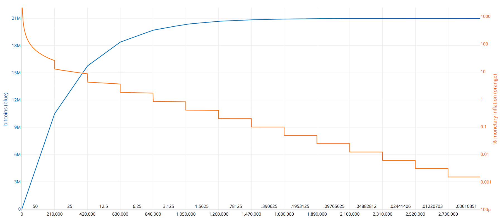
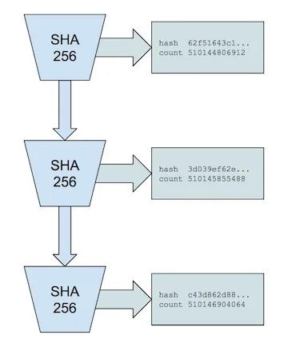
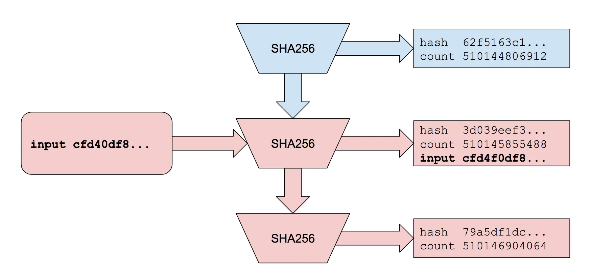
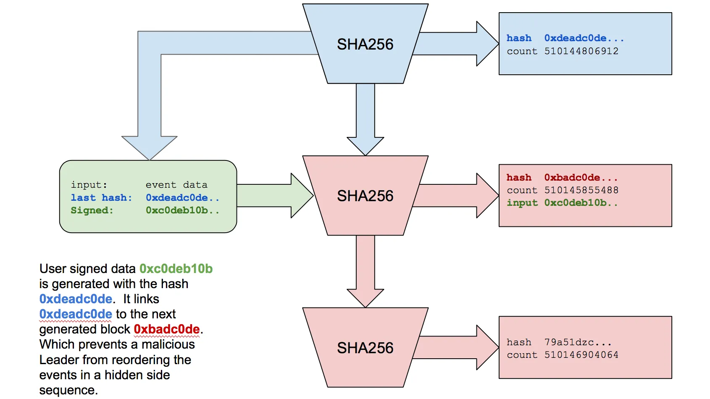
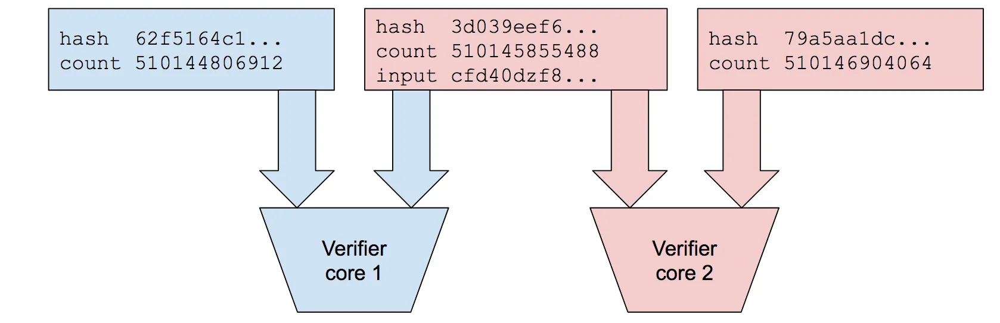

# PoW, PoS, PoH : Un guide simple des mécanismes de consensus blockchain


> **Note :** Les extraits de code dans cet article sont utilisés à des fins d'illustration et représentent des versions **simplifiées** des algorithmes afin de faciliter leur compréhension.

## TL;DR

1. Le mécanisme de consensus est un procédé par lequel les nœuds d'un réseau pair à pair se mettent d'accord sur un ensemble d'informations.
2. Le choix des algorithmes a des implications sur la sécurité, la décentralisation, la consommation énergétique et divers aspects d'une blockchain.
3. L'horodatage est un mécanisme qui permet d'associer une valeur temporelle à un événement.
4. La PoH n'est pas un algorithme de consensus, mais une "*horloge avant consensus*".


## Introduction

Les mécanismes de **consensus** permettent de se mettre d'accord sur une **version commune et unique** des données partagées par une blockchain et ce malgré la possible présence de nœuds **défaillants** ou **malicieux**.

Les principaux rôles des mécanismes de consensus sont les suivants :
1. **Obtenir un accord sur l'état partagé :** Prouver que les transactions sont valides, leurs ordres, leurs origines.
2. **Résister aux défaillances :** Le réseau doit fonctionner correctement même en présence de [nœuds défectueux ou malveillants](https://fr.wikipedia.org/wiki/Probl%C3%A8me_des_g%C3%A9n%C3%A9raux_byzantins) (🇫🇷).
3. **Décentraliser :** Cela permet une résistance accrue à la censure et à la nécessité d'une autorité centrale.
4. **Sécuriser :** Veiller à l'intégrité des données, préserver des altérations et assurer l'unicité.

Ils doivent aussi résoudre les enjeux majeurs des réseaux distribués, comme la double dépense. Le **solde** et l'**état** du réseau se doivent être **synchronisés**.

Voici trois parmi les principales méthodes en vigueur :
- La **preuve de travail** (*proof of work*) utilisée pour le **Bitcoin**.
- La **preuve d'enjeu** (*proof of stake*) utilisée maintenant par **Ethereum**.
- La **preuve d'historique** (*proof of history*) présente sur **Solana**. (*PoS en fait, la PoH s'y rajoute, mais on y reviendra plus tard*).


## ⚒️ Proof of Work (PoW)

La preuve de travail est la méthode de consensus utilisée dans **Bitcoin**, [**SHA-256**](https://fr.wikipedia.org/wiki/SHA-2#SHA-256) (🇫🇷) y est utilisé pour créer l’empreinte numérique d’un document (le timestamp est intégré au hash). Pour chaque bloc, un nœud doit trouver une solution à un "*puzzle*" mathématique qui dépend du contenu du bloc et de son précédent, [comme illustré ici](https://andersbrownworth.com/blockchain/blockchain) (🇬🇧).


### La difficulté de calcul

Entre en jeu la notion de [difficulté de calcul](https://en.bitcoin.it/wiki/Difficulty) (🇬🇧) qui consiste en un nombre variable et minimal de zéros à obtenir en début de résultat de hash (*leading zeros*) avec l'usage d'un *nonce* incrémental dans les itérations de calcul. Cette [difficulté est ajustée](https://www.blockchain.com/explorer/charts/difficulty) (🇬🇧) tous les **2016 blocs** (environs deux semaines) de manière à conserver un temps moyen entre chaque bloc en dessous de **10 minutes**.

Le premier nœud à résoudre correctement le calcul est récompensé par un certain nombre de bitcoins. Les nœuds vont essayer de trouver cette solution en utilisant leur puissance de calcul. Le temps nécessaire pour trouver la solution peut varier, mais il y aura toujours un gagnant d’une quantité de Bitcoins.

Notez qu’il n’y a pas de limite de nombre de participants et nul ne peut dire qui va arriver en premier.

Initialement, la récompense était de 50 bitcoins par bloc miné, mais cela se réduit de moitié approximativement tous les quatre ans dans un événement connu sous le nom de ["**halving**"](https://bitbo.io/halving/) (🇬🇧).

Au prochain halving (*article écrit début 2024*) qui aura lieu **mi avril 2024**, la récompense passera de **6,25 BTC** à **3,125 BTC** par bloc. 




(*source : [bitbo.io](https://buybitcoinworldwide.com/halving/)*)

Chaque halving réduit le taux d'inflation du Bitcoin. La **ligne orange** représente le **taux d'inflation** du Bitcoin pendant une période donnée, tandis que la **ligne bleue** représente le nombre total de **bitcoins émis**.


**Version simplifiée du minage (PoW) en Rust :**

```rust
fn mining_block(previous_block_hash: String, current_transactions: &Block, difficulty: usize) -> (String, u32) {
    let prefix: String = "0".repeat(difficulty);
    let mut nonce: u32 = 0;

    loop {
        let to_hash: String    = format!("{}{}{}{}", previous_block_hash, current_transactions.index, current_transactions.data, nonce);
        let block_hash: String = digest(to_hash);
        
        if block_hash.starts_with(&prefix) {
            return (block_hash, nonce);
        } else {
            nonce += 1;
        }
    }
}
```

> Sur une courte séquence de **5 blocs**, ma simulation de calcul a dû procéder à **370894 calculs de hashs** avant de les valider tous.


## 💰 Proof of Stake (PoS)

La preuve d’enjeu est une alternative à la preuve de travail. **Ethereum** se sert de [SHA-3](https://fr.wikipedia.org/wiki/SHA-3) pour créer l’empreinte numérique. Contrairement à Bitcoin, où les participants (*mineurs*) résolvent des problèmes complexes pour ajouter un bloc à la blockchain, la PoS requiert des efforts informatiques considérablement moins intensifs.

Les participants (*validateurs*) sont choisis pour ajouter un nouveau bloc.  Ces validateurs doivent **mettre en jeu** à **stacker** une quantité de cryptomonnaie en tant que garantie, ils seront soit récompensés (jetons, frais de transaction) pour leur travail, soit [pénalisés en cas de malveillance](https://ethereum.org/en/developers/docs/consensus-mechanisms/pos/#pos-and-security) (🇬🇧).

Le mécanisme des validateurs est déterminé par leur **enjeu** et il n'y a ainsi donc pas de nécessité à résoudre des problèmes mathématiques complexes. Par conséquent, la difficulté de recherche de *leading zeros* n'a pas de sens avec ce consensus.


### La carotte et le baton

L'idée fondamentale étant que les individus/entités qui ont un **intérêt financier** dans la stabilité et la sécurité du réseau sont moins susceptibles de se comporter de manière malveillante. Leur participation au consensus est basée sur la possession d'une quantité de cryptomonnaie mise en jeu plutôt que sur la puissance de calcul. Sur Ethereum la somme en jeu est de **32 ETH** par nœud.


**Version simplifiée de création de bloc (PoS) en Rust :**

```rust
fn creation_block(previous_block_hash: String, current_transactions: &Block) -> String {
    let to_hash: String    = format!("{}{}{}", previous_block_hash, current_transactions.index, current_transactions.data);
    let block_hash: String = digest(to_hash);
    block_hash
}
```

> Sur la même séquence de **5 blocs** que précédemment, il ne m'a fallu calculer que **5 hashs** pour les valider tous.


## 📜 Proof of History (PoH)

En 2008, **Satoshi Nakamoto**, dans son **["White paper"](https://bitcoin.org/bitcoin.pdf)** (🇬🇧) a introduit le concept de "**timestamp server**". Bien qu'il n'utilise pas explicitement le terme "*blockchain*" dans ce document, il décrit les principes fondamentaux qui sous-tendent la technologie blockchain. Le "*timestamp server*" était un élément clé pour sécuriser l'ordre chronologique des transactions dans le système Bitcoin.

> Le terme "*blockchain*" par la suite, est devenu plus couramment utilisé pour décrire la structure de données décentralisée qui enregistre de manière immuable les transactions au travers de blocs connectés les uns aux autres à l'aide de fonctions cryptographiques de hachage.

Comme dit dans l'introduction, la synchronisation des états est essentiel pour les blockchains, or celles-ci n'utilisent pas de solution centralisée, comme des horloges atomiques, pour résoudre leur problème d'unicité de temps.

La **preuve d'historique** (*Proof of history : PoH*) est un mécanisme utilisé par la blockchain **Solana** qui permet la synchronisation des événements de manière très performante. Elle se trouve ainsi combinée avec la *Proof of Stake*. Reposant sur une base de données distribuée appelée *Account State*. Chaque transaction est stockée dans cette base de données. Pour qu'elles soient acceptées, elles doivent être liées à une **transaction précédente** existante. La validation d'une transaction précédente implique la validation des suivantes.

La PoH est une sorte d'**horloge avant consensus** (*Clock before consensus*) qui permet de prouver l'écoulement du temps entre deux événements. Les nœuds n'ont pas à attendre d'être tous coordonnés au niveau de l'horodatage, dès qu'un événement arrive, il est impossible de placer ceux se produisant après, avant celui-ci.

En prenant un exemple simple, imaginez un **escalier**, pour en atteindre le haut, il faut d'abord gravir la première marche, puis la suivante, etc., jusqu'à atteindre la marche finale. La preuve d'historique garantit la validité de chaque transaction enchaînant la sienne à la précédente.


### Comment valider ce passage du temps numérique ?

Toujours en reprenant la métaphore des escaliers, imaginons un hash à chaque marche (*ou étape*). Le premier étage correspond au temps zéro et le dernier étage correspond au temps actuel ; on ne peut monter sur une marche que si on a monté la précédente. On ne peut donc avoir qu'une valeur de sortie donnée (*marche courante*) pour une valeur d'entrée (*la marche précédente*).

La PoS ajoute un registre d'historique des transactions et des blocs à chaque nœud. Cela permet aux utilisateurs de vérifier si leurs transactions ont été incluses dans le réseau ou pas.

La fonction utilisée pour créer ce registre est appelée **(High Frequency) Verifiable Delay Function** ou **VDF**.


### Verifiable Delay Function (VDF) ⏲️

Le VDF génère un résultat **unique et vérifiable**, par son exécution permanente, plusieurs milliers de fois par seconde. Sa caractéristique fondamentale réside dans l'impossibilité de prédire le résultat sans exécuter la fonction, conférant ainsi une garantie de sécurité.  

Cette fonctionnalité trouve son utilité dans la capacité à placer un événement de manière précise, avant ou après un autre, renforçant ainsi la robustesse de diverses applications blockchain et protocoles de consensus.



*(Pour reprendre l'exemple de l'escalier, chaque "marche" a été gravie à un temps donné)*

Le processus fonctionne en boucle, générant un hash (*SHA256*) à chaque itération. À chaque "tour" de fonction, le hash de sortie est réutilisé en tant qu'entrée, créant une chaîne continue de hachages. Le résultat de sortie est associé à un nombre défini, le décompte (*count*) ce résultat est enregistré périodiquement !

Ce qui nous assure que l'ordre enregistré pour chaque compteur est le même que celui qui s'est déroulé en temps réel.

Il est crucial de noter que le hash est résistant aux attaques de préimage (["preimage resistant"](https://fr.wikipedia.org/wiki/Attaque_de_pr%C3%A9image) 🇫🇷), ce qui signifie qu'il est impossible de déduire la valeur d'entrée à partir de la valeur de sortie.

Son exécution est :
- Atomique.
- Non parallélisable, s'exécute sur un seul cœur de **CPU**.
- Configurée pour maintenir une vitesse d'exécution homogène entre les nœuds. [(*ticks, slots, epochs* 🇫🇷)](https://cryptoast.fr/solana-sol-blockchain-atypique-grandes-ambitions/#De_quoi_est_composee_larchitecture_technologique_de_Solana)

Offrant ainsi une protection contre les calculs effectués par des **ASICs**. Cela garantit également un minimum de fiabilité pour le décompte du temps. En outre, le hash des données, telles que les transactions, est ajouté au dernier état généré. L'état, les données d'entré et le décompte sont ensuite publiés, assurant un horodatage directement encodé dans les messages de transaction.



*(Enregistrement de messages dans une séquence de Preuve d'Historique)*

Il est important de noter que le PoH ne garantit pas la chronologie absolue des transactions, mais uniquement leur **ordonnancement relatif**. Cela signifie qu'une transaction peut arriver après une autre même si elle est antérieure.

> **Preuve d'ordonnancement** pourrait aussi être un terme valable pour la PoH.

Les données insérées dans la PoH font référence aux précédentes  (`last_hash`). Les données entrantes sont ainsi auto-référenciées. Elle est incorporée en tant que partie du message, signé avec une clef privée lors de l'insertion, garantissant ainsi qu'elle ne peut pas être modifiée sans la clé privée. 



Et c'est parce que le message contient le hash `0xdeadc0de`, que nous savons qu'il a été généré après la création du décompte `510144806912`.


**Voici un exemple de code simplifié en Rust qui illustre un mécanisme de "Verifiable Delay Function" (VDF) :**

```rust
use sha256::digest;

const PERIOD: u64 = 1000;

struct VDFState {
    hash : String,
    count: u64,
}

impl VDFState {

    fn new() -> VDFState {
        VDFState {
            hash : String::new(),
            count: 0,
        }
    }

    fn execute(&mut self, data: &str) {
        self.hash   = digest(format!("{}{}", self.hash, data));
        self.count += 1;

        // Periodically check for the desired output
        if self.count % PERIOD != 0 { return;}
        self.output();
    }

    // Publish the hash, count, and other relevant data.
    fn output(&self) {
        // Must perform additional checks on the current state.
        println!("Hash: {}, Count: {}", self.hash, self.count);
    }

}

fn main() {
    let mut vdf = VDFState::new();

    // VDF simulation in a loop with new data (transactions).
    for _ in 0..10000 {
        let transaction_data = "Transaction Data"; // Replace with actual transaction data
        vdf.execute(transaction_data);
    }
}
```

Vous pouvez remplacer "*Transaction Data*" par les données réelles que vous souhaitez inclure dans le calcul du hash. Cet exemple n'inclut pas toutes les vérifications de sécurité, mais il donne une idée générale du fonctionnement d'un VDF dans un environnement de blockchain.

> **ENCORE UNE FOIS**, ce n'est qu'une **illustration simplifiée**.

Le choix de la valeur de `PERIOD` dépend des exigences spécifiques du système, y compris la tolérance au temps, la sécurité souhaitée et les ressources disponibles. Il est à déterminer par des considérations de conception spécifiques à votre cas d'utilisation.


### Des vérifications parallèles 🚀

Énorme avantage du mécanisme de la PoH, la vérification des preuves peut être effectuée en parallèle, tandis que leur création ne peut pas l'être (*VDF oblige*). Cela permet une fragmentation et une distribution efficace des tâches entre les différents cœurs d'un processeur, CPU ou [GPU](https://docs.solanalabs.com/operations/guides/validator-start) (🇬🇧).



*(vérifications en parallèle)*

Les horodatages précis, fournis par la Proof of History, permettent aux nœuds de travailler de manière indépendante sur plusieurs blocs en même temps, sans être bloqués par des dépendances temporelles.

La preuve devra contenir chaque hash intermédiaire, puis chaque calcul de hash intermédiaire pourra être vérifié en parallèle.

- **L'avantage** réside dans les performances, car cela réduit les surcoûts dans les échanges de messages et la latence en fournissant un ordre de transaction prédéterminé.
- **L'inconvénient** de cela est une taille de preuve très importante et des **[exigences matérielles](https://docs.solana.com/running-validator/validator-reqs)** (🇬🇧) généralement élevées pour les validateurs.


**Version simplifiée de la vérification de bloc (PoH) en Rust :**

```rust
// la bibliothèque (crate) `rayon` https://crates.io/crates/rayon
// est utilisée pour parallèliser les vérifications des messages.
use rayon::prelude::*;

// ...

block_chain.par_iter().for_each(|block| {
    par_verification(block);
});

post_synchro(&block_chain);
```

```rust
// Crate `rayon` https://crates.io/crates/rayon
// is used to parallelize messages verification.
use rayon::prelude::*;

fn par_verification(block: &Block, previous_block: &Block) -> Result<(), &'static str> {
    // Check if previous block hash is equal to current block hash.
    if block.previous_block_hash != previous_block.hash {
        return Err("Previous block hash don't match.");
    }

    if block.time_stamp <=  previous_block.time_stamp {
        return Err("Invalid timestamp.");
    }

    // Check if current block content is coherent.
    if !block.check_validity()  {
        return Err("Current block state is not valide.");
    }

    Ok(())
}

// Verify all blocks in the blockchain in parallel.
let results: Vec<Result<(), &'static str>> = block_chain
    .par_windows(2)  // windows of two consecutives blocks.
    .map(|window| par_verification(&window[1], &window[0]))
    .collect();

// Check for all verifications success.
if results.into_iter().all(|result| result.is_ok()) {
    post_synchro(&block_chain);
} else {
    // At least one fail.
    // ...
}
```

À Noter que la **Proof of History** en tant que telle ne garantit pas à elle seule la sécurité du réseau contre les attaques malveillantes, que ce soit **[l’attaque des 51%](https://coinacademy.fr/academie/quest-une-attaque-51-quelles-consequences/)** (🇫🇷), **[des 34%](https://www.linkedin.com/pulse/34-attack-smocking-art/)** (🇫🇷) ou **[l’attaque "Sybil"](https://coinacademy.fr/academie/attaque-sybil-attack-blockchain-noeud/)** (🇫🇷). C’est pourquoi elle est couplée avec la Proof of Stake sur **Solana**, ce qui permet de régler le problème.


## Conclusion

Les mécanismes de consensus, jouent un rôle crucial dans le fonctionnement des blockchains. Chacun de ces mécanismes présente des caractéristiques distinctes, influençant la sécurité, la décentralisation, les performances et la consommation énergétique d'une blockchain.

Tous essaient de résoudre la problématique qui consiste à concevoir un protocole permettant à un ensemble de processus de s'accorder sur des états/valeurs uniques, tout en étant résistant aux défaillances et malveillances.


--------

Crédits : **[Franck Maussand](mailto:franck@maussand.net)**

*Merci à [Igor Bournazel](https://github.com/ibourn) pour la relecture de cet article.*

N'hésitez pas à jeter un coup d'oeil sur mon précédent article sur le [**function dispatcher des EVM**](https://medium.com/@franck.maussand/optimisation-sur-ethereum-faites-la-diff%C3%A9rence-avec-les-noms-de-fonctions-ba4692c9e39f) (🇫🇷) !

--------


## Ressources additionnelles

- 🇬🇧 [The Energy Footprint of Blockchain Consensus
Mechanisms Beyond Proof-of-Work](https://arxiv.org/pdf/2109.03667)

- **Blockchains :**
  - 🇬🇧 [Bitcoin - Open source P2P money](https://bitcoin.org)
  - 🇬🇧 [Home | ethereum.org](https://ethereum.org)
  - 🇬🇧 [Web3 Infrastructure for Everyone | Solana](https://solana.com/)

- **Problème des généraux byzantins :**
  - 🇫🇷 [Problème des généraux byzantins — Wikipédia](https://fr.wikipedia.org/wiki/Probl%C3%A8me_des_g%C3%A9n%C3%A9raux_byzantins)
  - 🇬🇧 [Byzantine fault - Wikipedia](https://en.wikipedia.org/wiki/Byzantine_fault)

- **Hash :**
  - 🇫🇷 [Fonction de hachage — Wikipédia](https://fr.wikipedia.org/wiki/Fonction_de_hachage)
  - 🇬🇧 [Hash function - Wikipedia](https://en.wikipedia.org/wiki/Hash_function)
  - 🇫🇷 [SHA-2 — Wikipédia](https://fr.wikipedia.org/wiki/SHA-2#SHA-256)
  - 🇬🇧 [SHA-2 - Wikipedia](https://en.wikipedia.org/wiki/SHA-2)
  - 🇫🇷 [SHA-3 — Wikipédia](https://fr.wikipedia.org/wiki/SHA-3)
  - 🇬🇧 [SHA-3 - Wikipedia](https://en.wikipedia.org/wiki/SHA-3)
  - 🇬🇧 [Blockchain Demo - Hash](https://andersbrownworth.com/blockchain/hash)

- **Attaques :**
  - 🇫🇷 [Attaque des 51 %](https://fr.wikipedia.org/wiki/Attaque_des_51_%25)
  - 🇫🇷 [Attaque Sybil](https://fr.wikipedia.org/wiki/Attaque_Sybil)
  - 🇫🇷 [Qu’est-ce qu’une attaque Sybil (Sybil attack) ?](https://coinacademy.fr/academie/attaque-sybil-attack-blockchain-noeud/)
  - 🇫🇷 [Qu’est-ce qu’une attaque 51% et quelles sont ses conséquences ?](https://coinacademy.fr/academie/quest-une-attaque-51-quelles-consequences/)
  - 🇬🇧 [Ethereum PoS Attack and Defense — jmc](https://mirror.xyz/jmcook.eth/YqHargbVWVNRQqQpVpzrqEQ8IqwNUJDIpwRP7SS5FXs)
  - 🇬🇧 / 🇫🇷 [34% Attack](https://www.linkedin.com/pulse/34-attack-smocking-art/)
  - 🇬🇧 [Double-spending — 51% attack](https://en.wikipedia.org/wiki/Double-spending#51%_attack)
  - 🇬🇧 [Sybil attack](https://en.wikipedia.org/wiki/Sybil_attack)
  - 🇫🇷 [Attaque de préimage — Wikipédia](https://fr.wikipedia.org/wiki/Attaque_de_pr%C3%A9image)
  - 🇬🇧 [Preimage attack - Wikipedia](https://en.wikipedia.org/wiki/Preimage_attack)


- **PoW :**
  - 🇫🇷 [Bitcoin : un système de paiement électronique pair-à-pair](https://bitcoin.org/files/bitcoin-paper/bitcoin_fr.pdf)
  - 🇬🇧 ["Bitcoin: A Peer-to-Peer Electronic Cash System"](https://bitcoin.org/bitcoin.pdf)
  - 🇬🇧 [Blockchain Demo - Blockchain](https://andersbrownworth.com/blockchain/blockchain)
  - 🇬🇧 [What is Proof of Work? (Cryptocurrency Explanation)](https://www.youtube.com/watch?v=XLcWy1uV8YM)
  - 🇬🇧 [Blockchain.com | Charts - Network Difficulty](https://www.blockchain.com/explorer/charts/difficulty)
  - 🇬🇧 [Difficulty - Bitcoin Wiki](https://en.bitcoin.it/wiki/Difficulty)
  - 🇬🇧 [Next Bitcoin Halving 2024 Date & Countdown [BTC Clock]](https://bitbo.io/halving/)


- **PoS :**
  - 🇫🇷 [Proof of work / Proof of Stake : C'est quoi la différence ?](https://www.youtube.com/watch?v=dEGcAXeQsns)
  - 🇬🇧 [Proof-of-stake (PoS) | ethereum.org](https://ethereum.org/en/developers/docs/consensus-mechanisms/pos/)
  - 🇬🇧 [Proof-of-stake and security](https://ethereum.org/en/developers/docs/consensus-mechanisms/pos/#pos-and-security)
  - 🇬🇧 [What is Proof of Stake & How Does Confirmation Work in PoS?](https://coindcx.com/blog/crypto-basics/what-is-proof-of-stake-pos/)
  - 🇬🇧 [The Beacon Chain Ethereum 2.0 explainer you need to read first | ethos.dev](https://ethos.dev/beacon-chain)


- **PoH :**
  - 🇫🇷 [De quoi est composée l’architecture technologique de Solana ?](https://cryptoast.fr/solana-sol-blockchain-atypique-grandes-ambitions/#De_quoi_est_composee_larchitecture_technologique_de_Solana)
  - 🇬🇧 [Proof of History: How Solana brings time to crypto | Solana](https://solana.com/news/proof-of-history)
  - 🇬🇧 [Solana: A new architecture for a high performance blockchain](https://solana.com/solana-whitepaper.pdf)
  - 🇬🇧 [Break | Solana](https://break.solana.com/)
  - 🇬🇧 [Proof of History: A Clock for Blockchain by Anatoly Yakovenko](https://medium.com/solana-labs/proof-of-history-a-clock-for-blockchain-cf47a61a9274)
  - 🇬🇧 [Proof of History Explained by a Water Clock](https://medium.com/solana-labs/proof-of-history-explained-by-a-water-clock-e682183417b8)
  - 🇬🇧 [Joachim Neu — The Why and How of PoS Ethereum's Consensus Problem (ETHconomics @ Devconnect 2022) - YouTube](https://www.youtube.com/watch?v=2nMS-TK_tMw)
  - 🇬🇧 [GitHub - ethereum/annotated-spec: Vitalik's annotated eth2 spec.](https://github.com/ethereum/annotated-spec)


- **VDF :**
  - 🇬🇧 [Timelock Puzzles Using VDFs](https://medium.com/mistywest/timelock-puzzles-using-vdfs-b5636503950d)
  - 🇬🇧 [Day 54: VDFs: Verifiable Delay Functions in Blockchain](https://gsoares-block.medium.com/day-54-vdfs-verifiable-delay-functions-in-blockchain-addb3d89a72b)
  - 🇬🇧 [Verifiable Delay Functions](https://www.youtube.com/watch?v=_-feyaZZjEw)
  - 🇬🇧 [Verifiable Delay Functions: Applications and Candidate Constructions - BPASE '18](https://www.youtube.com/watch?v=qUoagL7OZ1k)
  - 🇬🇧 [Verifiable Delayed Functions I - CANARI](https://canari.math.u-bordeaux.fr/seminar/ciao-2020-02-04-1400-BenjaminWesolowski.pdf)
  - 🇬🇧 [Verifiable Delay Functions - A brief and gentle introduction](https://medium.com/iovlabs-innovation-stories/verifiable-delay-functions-8eb6390c5f4)


- **Hardware Requirements for Solana :**
  - 🇬🇧 [Validator Requirements | Solana Docs](https://docs.solana.com/running-validator/validator-reqs)
  - 🇬🇧 [Solana Nodes - The Complete Guide (2023)](https://www.alchemy.com/overviews/solana-nodes)
  - 🇬🇧 [Starting a Validator (Enabling CUDA)](https://docs.solanalabs.com/operations/guides/validator-start)

